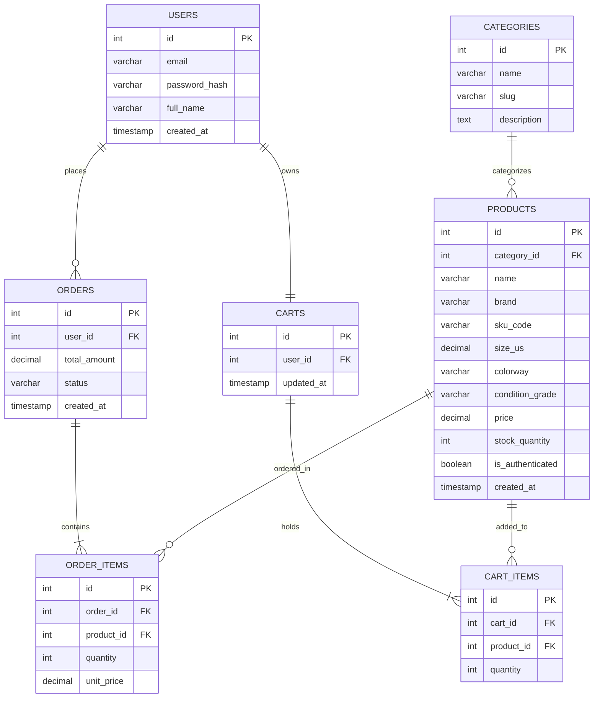

# Sprint 1: System Architecture & Scope Definition

* **Course:** E-Commerce
* **Project Name:** SoleVault (Authenticated Collectible Sneakers)
* **Name:** Yasir Parveez
* **File Location:** `/docs/SPRINT_1.md`

---

## Section 1: Target Audience & Market Focus

### Primary Persona
* **Demographic:** Sneakerheads, streetwear collectors, and retail footwear enthusiasts aged 18–35 looking to buy and trade rare, limited-edition, or deadstock sneakers.
* **Characteristics:** High brand awareness, digitally native, mobile-first shoppers who require absolute certainty regarding product authenticity, precise sizing, and condition verification prior to purchase.

### Core Pain Point
Online secondary sneaker marketplaces are saturated with counterfeit pairs, inconsistent condition descriptions, and fragmented sizing data. Buyers lack a single, reliable platform offering multi-point authenticity verification, transparent grade condition reporting, and real-time inventory tracking for scarce footwear.

### Domain Scope
* **Vertical Market:** Apparel & Secondary Market Footwear.
* **Scope Boundaries:** Direct-to-consumer (D2C) marketplace centered on deadstock and certified authentic collectible sneakers, featuring detailed SKU indexing, condition grades, size selection, and order processing.

---

## Section 2: Minimum Viable Product (MVP) Feature Scope

| Category | Feature Name | Description | Priority |
| :--- | :--- | :--- | :--- |
| **Authentication** | User Registration & Authentication | Secure customer signup and login utilizing bcrypt password hashing and stateless JWT-based authentication. | High (MVP) |
| **Catalog** | Sneaker Catalog & Filtering | Product catalog with search and multi-attribute filtering by brand, release year, US shoe size, and condition grade. | High (MVP) |
| **Cart** | Persistent Cart Management | Session- and account-bound shopping cart with support for item addition, size adjustments, and deletions. | High (MVP) |
| **Checkout** | Order & Payment Processing | Checkout pipeline validating item stock, calculating totals, and integrating Stripe test gateway for order placement. | High (MVP) |
| **Admin** | Sneaker Inventory Management | Administrative dashboard for CRUD operations on sneaker listings, stock adjustments, and authentication status updates. | Medium |

---

## Section 3: Tech Stack Selection & Justification

* **Frontend Framework:** Next.js (React)
  * *Justification:* Server-Side Rendering (SSR) and dynamic asset optimization ensure fast visual rendering for high-resolution sneaker media and rapid SEO indexing of individual product listings. Next.js offers a component-driven architecture that simplifies state handling across size pickers and dynamic cart interactions.
* **Backend Infrastructure:** Node.js with Express.js
  * *Justification:* Node.js delivers an efficient, asynchronous event loop ideal for handling concurrent browse and checkout traffic. The Express framework provides a robust middleware ecosystem for JWT parsing, input validation, and secure Stripe webhook ingestion.
* **Database Management System:** PostgreSQL
  * *Justification:* PostgreSQL provides strict ACID compliance necessary for order transactions and low-stock inventory locks, preventing overselling on single-unit sneaker pairs. Its strong relational capabilities ensure referential integrity between orders, line items, and product sizes.
* **Caching & Asynchronous Processing (Optional):** Redis
  * *Justification:* Employed for low-latency session store maintenance and caching transient cart payloads to minimize redundant database reads.

---

## Section 4: Entity-Relationship Diagram (ERD)

### Data Modeling Specifications
* **Keys:** Primary Keys (`PK`) and Foreign Keys (`FK`) are defined across all entities.
* **Cardinality Constraints:**
  * `USERS` to `ORDERS`: 1 to Many ($1:N$)
  * `USERS` to `CARTS`: 1 to 1 ($1:1$)
  * `CARTS` to `CART_ITEMS`: 1 to Many ($1:N$)
  * `PRODUCTS` to `CART_ITEMS`: 1 to Many ($1:N$)
  * `ORDERS` to `ORDER_ITEMS`: 1 to Many ($1:N$)
  * `PRODUCTS` to `ORDER_ITEMS`: 1 to Many ($1:N$)
  * `CATEGORIES` to `PRODUCTS`: 1 to Many ($1:N$)

